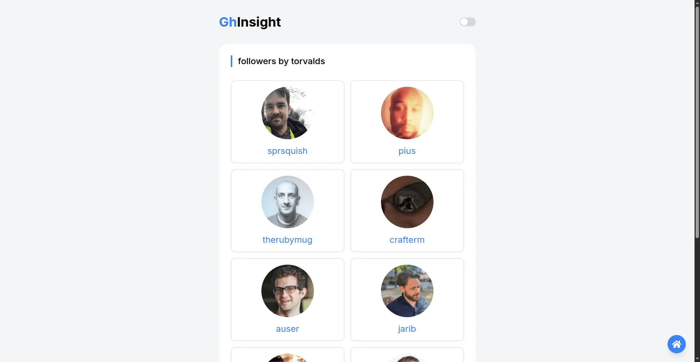
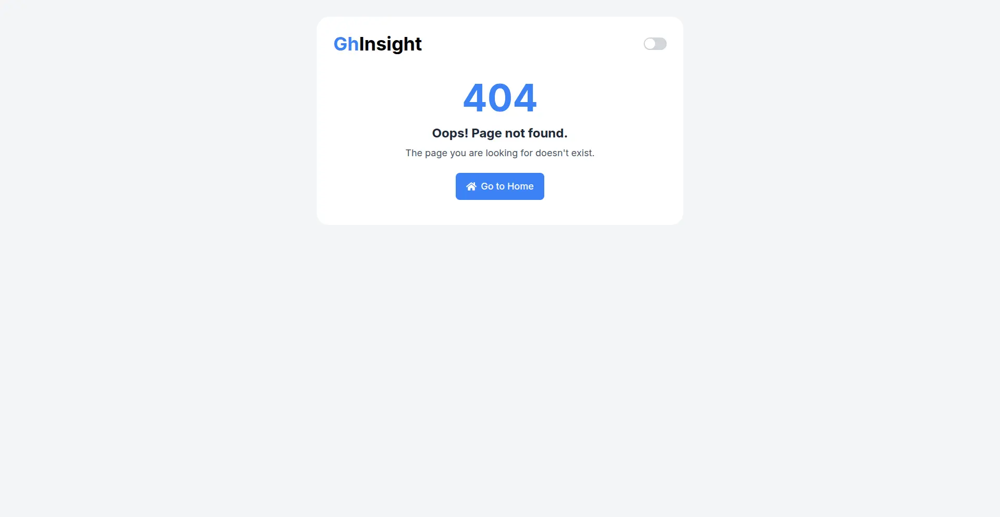

# Ghinsight — GitHub Profile Finder App

A modern GitHub profile finder web app built with React and Tailwind CSS.  
Search any GitHub user and view their profile information and repositories — with responsive design and dark/light mode support.

---

## 🚀 Features

- 🔍 Search GitHub users by username
- 🧑‍💻 View user profile details:
  - Avatar, Name, Bio, Location
  - Followers, Following, Public Repositories
  - Profile Link
- 📦 List public repositories:
  - Repo name, description
  - Stars ⭐
  - Language
  - Repo link
- ⚡ Live API fetching from GitHub REST API
- 🌙 Dark and Light mode toggle
- 📱 Responsive design — mobile-friendly
- 🛠 Built with modern stack (React + Vite + Tailwind CSS)

---

## 📸 Screenshots





---

## ⚙️ Tech Stack

- **Frontend:** React (Vite)
- **Styling:** Tailwind CSS
- **HTTP Requests:** Axios
- **State Management:** React Hooks (useState, useEffect)
- **Icons:** React Icons
- **API:** GitHub REST API (v3)

---

## 🛠 Installation & Setup

1. Clone the repo:

```bash
git clone https://github.com/surajsht/ghinsight.git
cd ghinsight
```
